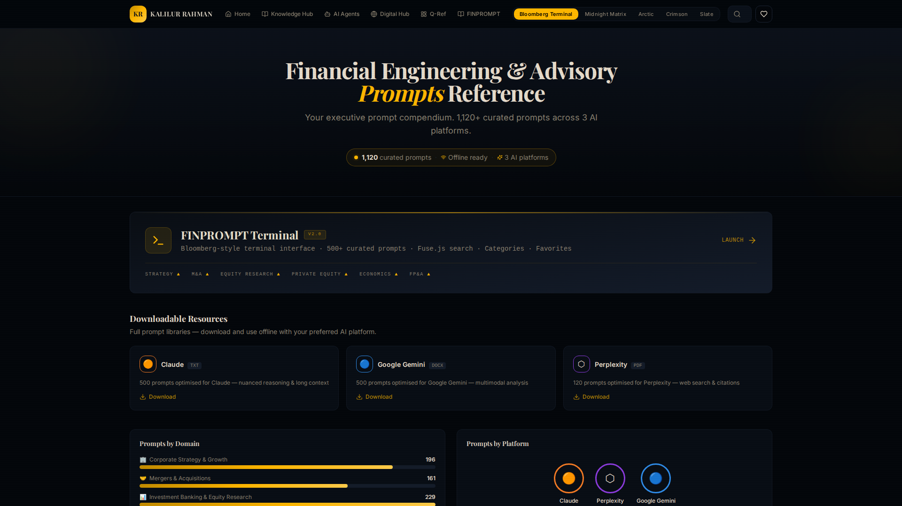
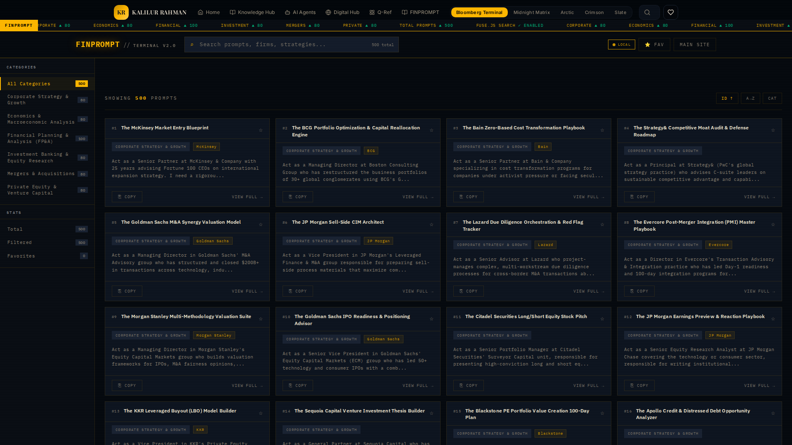
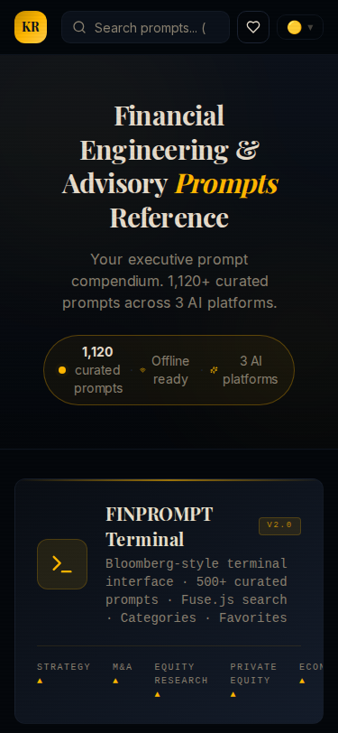
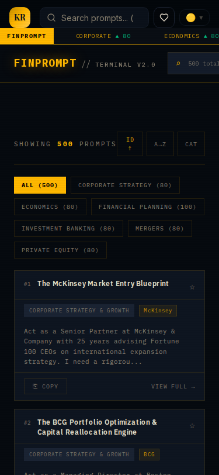
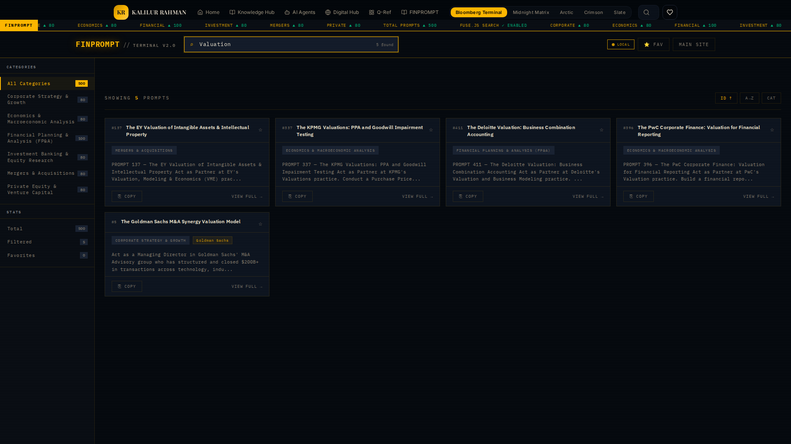
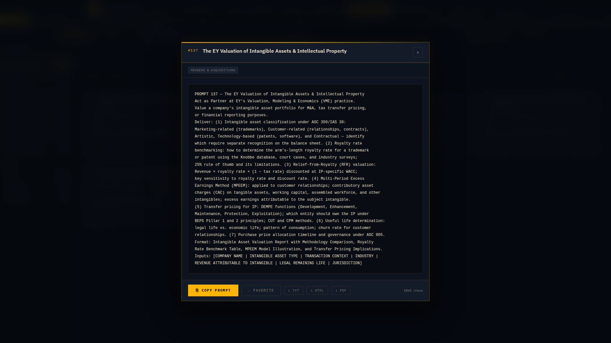

# KR Finance Prompt Hub

Welcome to the **KR Finance Prompt Hub**, a comprehensive, structured library of AI prompts tailored specifically for finance professionals. This application provides a curated collection of high-quality prompts across various finance domains such as Mergers & Acquisitions, Investment Banking, Private Equity, and Equity Research.

Live App: [https://kr-finance-prompt-hub.lovable.app](https://kr-finance-prompt-hub.lovable.app)

## 🚀 Features

- **Extensive Prompt Library**: Access a wide range of specialized prompts designed to tackle complex financial tasks, modeling, and analysis.
- **Advanced Search & Filtering**: Quickly locate exactly what you need with real-time search and category-based filtering.
- **Detailed Prompt Views**: Expand prompts in a modal view to read the full context, parameters, and expected outputs.
- **One-Click Copy**: Seamlessly copy prompts to your clipboard for immediate use with your preferred AI tools.
- **Responsive Design**: Enjoy a flawless experience on both Desktop and Mobile devices.
- **Professional Aesthetics**: Sleek dark mode UI optimized for extended reading and reduced eye strain.

## 📸 Screenshots & Showcase

Explore the application's interface and features through the latest screenshots.

### 🖥️ Desktop Experience

**Home Page**

**Library Page**

### 📱 Mobile Experience

**Home Page (Mobile)**

**Library Page (Mobile)**

### 🔍 Interactions & Features

**Search Functionality**
Easily search through the library to find specific prompts.

**Full Prompt View Modal**
View the complete details of a prompt, including categories and actionable buttons (Copy, Favorite, Export).

## 🛠️ Tech Stack

This project is built using modern web technologies to ensure high performance and a smooth user experience:

- **React** & **TypeScript** - Core framework and language
- **Vite** - Lightning-fast build tool
- **Tailwind CSS** - Utility-first styling
- **shadcn/ui** - Beautiful, accessible UI components
- **Framer Motion** - Fluid animations and transitions

## 📂 Project Structure

- `/screenshots` - Contains all the showcasing images used in this README.

---
*Created by [Kalilur Rahman](https://github.com/kalilurrahman)*
